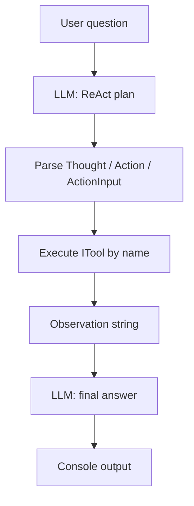

# thinkpalm-agentai-neethu-react-agent

**Name:** Neethu Nandakumar  
**Track:** Agentic AI  
**Lab:** ReAct Agent with Tool Integration

## Project Overview

This repository contains a minimal **.NET 8** console application that demonstrates a **ReAct-style** (Reasoning + Acting) agent workflow. The agent uses **Google Gemini** for reasoning, **parses** a structured plan (`Thought` / `Action` / `ActionInput`), **executes** a selected tool at runtime, feeds the **observation** back to the model, and prints a **final answer**. Tools include an English **dictionary** lookup (public HTTP API) and a constrained **calculator** for addition and subtraction.

## Architecture

- **Program.cs** — Host bootstrap, `HttpClient` registration, reads the user question, invokes `AgentService`, and prints each step.
- **LlmService** — Builds prompts, calls Gemini’s `generateContent` REST API via `HttpClient`, and parses ReAct fields from the response text.
- **AgentService** — Runs the loop: plan → tool dispatch by name → observation → second prompt for the final answer.
- **Tools** — `ITool` with `Name` and `Execute`; `DictionaryTool` and `CalculatorTool` are resolved from DI and indexed by name for dynamic selection.
- **Models** — `AgentStep` records what to show in the console; `ToolResult` describes tool outcomes (available for extensions).



## Folder Structure

```
/src/ReactAgentDemo/          — .NET 8 console project (assembly: thinkpalm-agentai-neethu-react-agent)
    Program.cs
    Services/
        AgentService.cs
        LlmService.cs
    Tools/
        ITool.cs
        DictionaryTool.cs
        CalculatorTool.cs
    Models/
        AgentStep.cs
        ToolResult.cs
/screenshots/                 — placeholder for lab screenshots
README.md
```

## How to Run

1. **Prerequisites:** [.NET 8 SDK](https://dotnet.microsoft.com/download/dotnet/8.0) installed.

2. **Set your API key** (required):

   ```powershell
   $env:GEMINI_API_KEY = "your-key-here"
   ```

   Optional: override the model (default is `gemini-1.5-flash`):

   ```powershell
   $env:GEMINI_MODEL = "gemini-2.0-flash"
   ```

3. **Build and run** from the repository root:

   ```powershell
   dotnet run --project src/ReactAgentDemo/ReactAgentDemo.csproj
   ```

4. Enter a question at the prompt (e.g. “What is intelligence?” or “What is 42 - 17 + 5?”). Type `exit` to quit.

## Tools Used

| Tool | Role |
|------|------|
| **.NET 8** | Console host, DI, async I/O |
| **Microsoft.Extensions.Hosting** | Generic host and service registration |
| **Microsoft.Extensions.Http** | Typed/named `HttpClient` for Gemini and the dictionary API |
| **Gemini API** | LLM reasoning and final answer generation |
| **Free Dictionary API** | `https://api.dictionaryapi.dev/api/v2/entries/en/{word}` |

## Observations

AI coding assistants such as Cursor AI significantly improve developer productivity by automating boilerplate code generation. They also help implement architectural patterns quickly and reduce development time.

Structured tool-calling patterns (like ReAct) make it easier to trace *why* a model chose an action and to swap tools without changing the core orchestration code.
